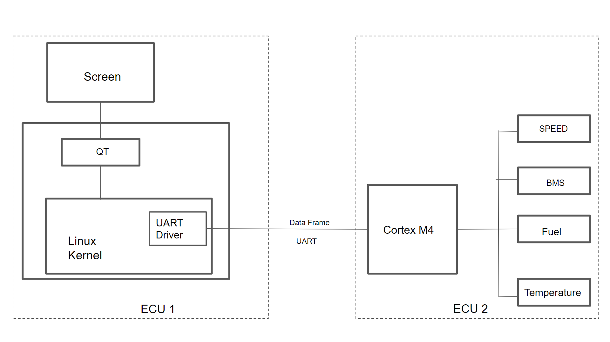

## Information Technology Institute

## New Capital Branch

# Vehicle Dashboard to Display Sensors

# Data

Graduation Project

Authors: Mohamed Alaa

Mohamed Beshir

Mahmoud Hamed

Mennatallah Ibrahim

Nadine Ashraf

Khaled Rashad

```
Intake:
43 - Group
```
Submission Date: 23 , February, 2023


## Content

- Chapter
   - 1.1 Project Objective
   - 1.2 System Overview
- Chapter
   - 2.1 Introduction
   - 2.2 Software Architecture
      - 2.2.1 ECU1
      
      - 2.2.2 ECU2
      
   - 2.3 Hardware Circuit Diagram
- Chapter
   - System Implementation
   - 3.1 Introduction
   - 3.2 Implementation
   
      - 3.2.1 Fuel level
      - 3.2.2 Temperature
      - 3.2.3 Seatbelt
      - 3.2.4 ABS
      - 3.2.5 Speed
      - 3.2.6 Battery management system
      - 3.2.7 UART Communication Protocol
      - 3.2.8 GUI using QT
- Chapter
   - 4.1 Results and conclusion
- References


### List of Figures

Figure 1.1: Mercedes Car Dashboard

Figure 2.1 HW Circuit Diagram

Figure 4.1: Car Dashboard

Figure 4.2: Car Dashboard

Figure 4.3: Car Dashboard

Figure 4.4: Car Dashboard


### List of Tables

Table 1: Hardware Components


## Chapter 1

### Introduction

According the expansion of new technologies and the competing between car makers to provide
entertainment to the driver, a new modern system was innovated to replace the old ones to
display additional features as shown in Figure 1.1. The dashboard in your car is the control panel
of your vehicle. It provides you with all the information you need to know, as well as houses the
instruments and controls for operating the vehicle properly.

The dashboard provides many different features to provide you with warnings and information

#### that you need to take note of while going down the road. It would not only be difficult but also

dangerous to operate a car without a dashboard. The car dashboard performs many important
functions, which often provide drivers with invaluable help. This is where you can adjust the air
conditioning or heating, operate individual lights or monitor the car's performance; it is also the
location of the airbags for both driver and passenger. What is more, the lights on the dashboard
allow you to quickly identify problems with various components of the vehicle. This Project
aims to be portable with different system as it’s compliant to industrial Standards and integrated
with free GPL Licensed Software to meet customers’ needs.


Figure 1. 1 : Mercedes Car Dashboard


### 1.1 Project Objective

Our aim in this project is to Implement Multiple ECUs and interfacing between them through
UART. Master ECU: is based on Application SW being deployed on High Performance Board
(Raspberry Pi) to display the acquired data by second ECU. Other ECUs: Are used to acquire
data from different sensors and sending them to the Master ECU over the UART to display them.

### 1.2 System Overview

Our system can be break downed into two major parts:

Hardware: It was selected for the application purpose.

Component Purpose

RaspberryPi3B+ Works as a host machine and to receive the data from other ECU
(Cortex M4 MCU) to be processed by SW to display it on the
Graphical LCD.

Graphical LCD Used to display Dashboard widgets on it, which is designed using QT
Creator SW.

Cortex M4 MCU Used as a host ECU to acquire the data from sensors and process it to
send them through the UART communication protocol.

Current Sensor Used to measure the current passed through the wire to get the get the
state of charge of the electric batteries

RC Robot Encoder Used for acquiring speed of Rotated wheels as it’s physically
measured.

Logic Analyzer Used as a debugging tool for integration and Testing.

Table 1 : Hardware Components


Software: It’s based on the team efforts to build and integrate SW listed by the HW vendors
and also for software developers. We will implement and configure the modules and drivers
required to perform our needed applications. The drivers needed are:

RCC, GPIO, ADC, Timer, UART, LCD, DMA, NVIC & SYSTICK.

RCC: Peripheral used to control the clock of the clock source of the internal peripherals as well
as the reset signal.

GPIO: The general-purpose I/O ports is used for driving loads, reading analog and digital
signals, controlling external components, generating triggers for external devices as push button
indicating the seat belt and ABS.

ADC: To convert the analog signal readings from the potentiometer to digital readings that
detects the fuel level, as well as the temperature of the engine.

SYSTICK/NVIC: Used with the Encoder to measure the speed of the vehicle.

UART: It is the communication protocol used to send the data from the RaspberryPi to the
Cortex M4 MCU.


## Chapter 2

### Control Design

### 2.1 Introduction

In order to build and integrate the system properly standard methodologies were followed to
increase the portability of it and also to facilitate the debugging and integration processes.

Following both HW and SW design for ECU1 and ECU2 and interfacing between them to get
the data and display them.


### 2.2 Software Architecture

#### 2.2.1 ECU1


```
The software of this ECU is deployed on single Core Microcontroller (Cortex M4). And it
worked one in synchronous single thread starting from initializing the system and pending on
reading the data and sending them as will mentioned in details in the next section.
```

#### 2.2.2 ECU2


The software of this ECU is deployed on multiple core Board Raspberry pi3 B+ board, and
it’s worked as an application that interfaced with Linux Kernal and device driver to interface
with HW peripherals.

In order to get the data and display it simultaneously, two threads run parallelly to get the data
and update the GUI with the new data based on timer signals every 50 Millis Second.


### 2.3 Hardware Circuit Diagram

Before implementing the electrical circuit and the control panel, a schematic diagram is drawn
and tested with color coded connection to ease the tracing and guarantee that the circuit is
performing correctly at its all modes of operation.


Figure 2. 1 HW Circuit Diagram


## Chapter 3

### System Implementation

### 3.1 Introduction

In his chapter the details and description of the system implementation will be discussed.

Our software application is three layered architecture software. It is classified into MCAL, HAL
& SERVICE Layer.

MCAL consists of the software module that directly accesses on-chip MCU peripheral modules
and external devices that are mapped to memory, and makes the upper software layer
independent of the MCU. In our project we have RCC, GPIO, SYSTICK, NVIC, EXTI, UART,
ADC and MSPI in the MCAL layer.

A hardware abstraction layer (HAL) is the layer that allows for more broad communication
between software and hardware in a system. In our project we have ADC_conversion,
DATA_FRAME, ENCODER, System_Init and Time in the HAL layer.

A Service Layer defines an application's boundary and its set of available operations from the
perspective of interfacing client layers. It encapsulates the application's business logic,
controlling transactions and coordinating responses in the implementation of its operations. In
our project we have Fuel level, Temperature, seatbelt, ABS, Speed and Battery Management
System in the SERVICE layer.

### 3.2 Implementation

#### 3.2.1 Fuel level

```
In our project we needed to detect the fuel level in the tank to indicate whenever it is falling
below the minimum level assigned which indicate its need to be refilled. We achieved that by
using potentiometer as HW simulator for the fuel level. We used 10 - bit ADC peripheral to
interface with the analog input from the potentiometer which mapped to a digital signal then.
We also used MIL (Malfunction Indicator Light) which is a small, yellow engine-shaped light
indicates that the car's electronic system has detected a problem that needs to be checked and
here it is activated when fuel level is low
```

#### 3.2.2 Temperature

We also used potentiometer to simulate the temperature degrees of the car’s engine. We
indicated the temperature degrees ranges from 0°C to 250°C where these values were mapped
using 10 bit ADC peripheral with resolution of 1024. We also used MIL here where it detects
whenever the temperature exceeds a certain degree.

Since in our MCU we have only one ADC peripheral, we used it for both fuel level and
temperature detecting by generating two channels from the ADC. We had to use two
potentiometers, one for the fuel level and the other for temperature. The ADC toggles between
the two channels to gather the data and readings from both. In order to be able to do that we
had to use DMA, to transfer ADC measurements results after conversion to CPU0 DSPR and
put them in array to be read periodically.

This array consists of two elements, one for fuel and the other for temperature. Going to the
HAL layer, we return the reading of the value of these two elements as per requested and
configured. We now need to send these values from the MCU to the RaspberryPi to display
these data; therefore we will use UART communication protocol.

#### 3.2.3 Seatbelt

We indicated whether the seatbelt is fastened or not using a push button. If the push button is
pressed this means that the belt is not fastened and the MIL will be ON giving me an error that
I need to fasten the belt, otherwise it means it is fastened.

#### 3.2.4 ABS

We indicated whether the ABS is activated or not using a push button. If the push button is
pressed this means that the ABS is activated, if not pressed, it means it is activated.

#### 3.2.5 Speed

There are some basic topologies that are worthy to be mentioned.

Accuracy: it refers to closeness of the measurements to the true value. The more accurate sensor
is preferred but it’s not enough because accuracy comes at the expenses of other criteria.

Noise: the faster sampling of the readings, the more noise appearance on the signal, so algorithms
and filters are applied to get pure readings in a short time.

Sampling Rate: is the number of samples produced each second, for GPS it’s once a second,
which is fine for navigation, but it is not usable for measuring speed, braking distance and
acceleration.


Latency: is the delay between the change in vehicle motion, and the output of sensors. Latency is
only important if different parameters are measured at the same time.

Response: it describes how fast sensor output can react to a change in vehicle motion.

According to the previous criteria, different kind of sensors shall be used to get the best of
estimation closes to the true value. In this project an Encoder is used to figure the out the
speed.

Another kind of sensors shall be used with Encoder to reduce the noise. Get accurate data,
GPS and IMU sensor have almost the same output, but proximity sensor is preferred because
GPS positioning relies on precise measurements of the distance from the receiver to the
satellite, and therefore it suffers from numerous effects - such as atmospheric interference -
which delays the signal.

#### 3.2.6 Battery management system

Because of nonlinearity behavior of battery state of charge, they are several ways shall be
used to detect state of charge e.g., Measured Voltage, Integration of Passed Current, Pressure
and heat of battery chemical reaction.

A Simple method (Voltage Level) was used in this project as it’s hard to find mathematical
behavior of the test battery and also, it’s was not applicable in our application to charge or
discharge the battery for safety wise.

#### 3.2.7 UART Communication Protocol

After gathering data from our sensors and our other external devices, we need to send these
data through our communication protocol peripheral which is UART in our project. Therefore
we needed to activate our drivers to send and receive data from ARM MCU to RaspberryPi.
In the service layer we will sent a frame through which our data will be sent.

This frame consists of MSGID(message id), DLC(data length code) which indicates the length
of our frame data in bytes, DATA which is the data itself needed to be sent, CRC (cyclic
redundancy check) which is XORing for the bytes of the data with the DLC. To send these
data we go to the service layer and request to send these data through UART using this frame
with this message id and the data length and then receive this data on raspberry pi.

To receive this frame, we first check frame the data length code (DLC) to know the data
length since it is dynamic length code then recognize this message id to know which data it
belongs to. This data is stored in a variable which then is mapped to its specific variable in the
GUI to be represented to the user.


#### 3.2.8 GUI using QT

GUI program consists of two threads each thread is in separate module. We will discuss
below each module and how it operates:

- First module is for communication with the other ECU through UART.
It's responsible for receiving data and updating reading values. It consists of two functions.
First one (UARTvidInit) is a UART initialization function to setup the required configuration.
Second one (UARTvidReceive) is a function that receives data from UART and assign it to
reading variables. Data received from UART are checked reassembled by this function
- Second module is responsible for data visualization. It uses QT frame work.
First we designed the GUI structure and appearance and added the required objects then we
added a timer as a signal to call a slot regularly. The slot is (WidgetvidUpdateValues) a
function that updates data in GUI according to reading variables updated from UART module.

Now we will discuss the process of reading in the GUI,

We have 4 variables which are Temperature Value, Battery Value, Speed Value, Fuel Value
and Anti-Lock Flag. We will discuss below the usage of each variable:

TempValue: It is a variable that resembles engine temperature. If the temperature is greater
than or equal 100 °C, an overheat flag arises. Else, no flag arises.

BatteryValue: It is a variable that resembles battery status. If the battery charge is less than
20%, the battery’s light turns red. Else, battery’s light turns green.

SpeedValue: It is a variable that resembles car’s speed in Km/hr.

AntiLockFlag: Flag resembles antilock brake warning

FuelValue: It is a variable that resembles fuel level. If the fuel level is less than 20%, a fuel
low flag arises. Else, no flag arises.

SeatBeltFlag: It is a flag that resembles a seat belt warning if it is not fastened.

Note: The GUI starts at booting automatically when the system is on.


## Chapter 4

## Results and Conclusion

### 4.1 Results and conclusion

The “vehicle Dashboard to Display Sensors Data” project is successfully implemented as
proposed previously. The data frame is being sent successfully from ARM MCU which is
holding the data gathered from the actuators. These data is being received on the RaspberryPi
through UART communication protocol and the data is checked through the CRC check. The
GUI is acquiring the data and displaying them periodically on the screen to know if any changes
have been done.

Next we will represent some results from the GUI:

The picture below Fig. 4 .1 indicates low engine temperature, low speed, half the fuel tank is full
and low battery level notification.


# Figure 4. 1 : Car Dashboard


The picture below Fig. 4. 2 indicates high engine temperature and its MIL is activated, high
speed, about half the fuel tank is full and charging battery state level notification.


Figure 4. 2 : Car Dashboard

The picture below Fig. 4. 3 indicates low engine temperature, low speed, low level fuel tank and
its MIL is activated and low charging battery state level notification and its MIL activated in red.


Figure 4. 3 : Car Dashboard


The picture below Fig. 4. 4 indicates high engine temperature and its MIL is activated, high
speed, low level fuel tank and its MIL is activated and charging battery state level notification
and its MIL activated in green.


Figure 4. 4 : Car Dashboard

# Figure 4. 4 : Car Dashboard


## References

1. https://docs.google.com/spreadsheets/d/1rbeM-F-
    JKqug1kioDAU9RooQZ36_CAr7/edit#gid=482852532&range=E2:E
2. https://github.com/alzahraaelsallakh/Infotainment-System-Yocto
3. https://deepbluembedded.com/stm32-timer-encoder-mode-stm32-rotary-encoder-interfacing/
4. https://www.badprog.com/electronics-stm32-using-the-adc-peripheral-with-a-potentiometer
5. https://www.digikey.com/en/maker/projects/getting-started-with-stm32-working-with-adc-and-
    dma/f5009db3a3ed4370acaf545a3370c30c
6. https://www.electronicshub.org/how-to-use-adc-in-
    stm32f103c8t6/#:~:text=So%2C%20the%20range%20of%20ADC,calculated%20using%20the
    %20following%20formula.


